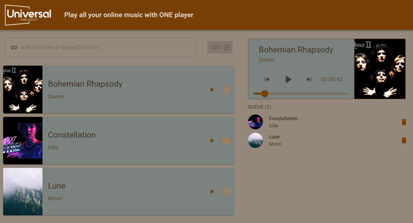

<!-- PROJECT LOGO -->
 

  <h2 align="center">Universal Music Playlist</h2>
  <h4> Play all your online music with ONE player </h4>

  
 
    <a href="">View Demo</a>
    ·
    <a href="https://github.com/feliceforgione/UniversalMusicPlaylist/issues">Report Bug</a>
    ·
    <a href="https://github.com/feliceforgione/UniversalMusicPlaylist/issues">Request Feature</a>
  

  

<!-- ABOUT THE PROJECT -->

## About The Project

Add music from Youtube or Soundcloud to ONE playlist that will play these online songs in the same application.  
No longer to you have to jump to different websites to play your favorite music.

 

### Built With

- [Node.js](https://nodejs.org/en/)
- [React](https://reactjs.org/)
- [Material UI](https://mui.com/)
- [Apollo](https://www.apollographql.com/)
- [Hasura](https://hasura.io/)

 

<!-- ROADMAP -->

## Roadmap

- [ ] Add Facebook
- [ ] Add Mixcloud
- [ ] Organize Music by Genres
- [ ] Sublists

 

See the [open issues](https://github.com/feliceforgione/UniversalMusicPlaylist/issues) for a full list of proposed features (and known issues).

 

<!-- CONTRIBUTING -->

## Contributing

Contributions are what make the open source community such an amazing place to learn, inspire, and create. Any contributions you make are **greatly appreciated**.

If you have a suggestion that would make this better, please fork the repo and create a pull request. You can also simply open an issue with the tag "enhancement".
Don't forget to give the project a star! Thanks again!

1. Fork the Project
2. Create your Feature Branch (`git checkout -b feature/AmazingFeature`)
3. Commit your Changes (`git commit -m 'Add some AmazingFeature'`)
4. Push to the Branch (`git push origin feature/AmazingFeature`)
5. Open a Pull Request

 
<!-- CONTACT -->

## Contact

Felice Forgione - [@forgione67](https://twitter.com/forgione67)

Project Link: [https://github.com/feliceforgione/UniversalMusicPlaylist](https://github.com/feliceforgione/iEats)
